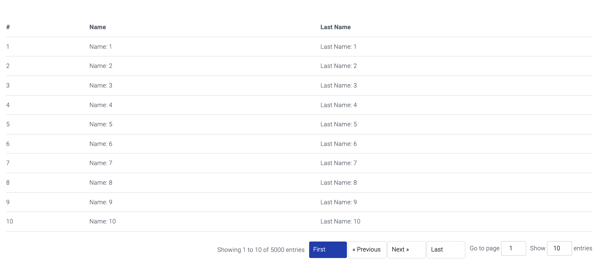

# Simple pagination of a Javascript collection

A Javascript **class** to provide simple pagination to an array collection with a custom template callback function to render the current pagination page without the need of any external libraries.

##### Screenshots



##### Usage
Create javascript object based on the Pagination class and pass the require parameters.

```javascript
var p = new Pagination({
  element:"my_table",
  data:array_data,
  pageSize:10,
  template: function(data){
    // Access to current page pagination data
  }
});
```

#### Parameters (required)
**element** is the DOM element ID of where the pagination menu is going to be place below of.

**data** is the collection array to be paginated.

**pageSize** number of records to show per pagination page.

**template** is a callback function exposing the current pagination page data.

#### Parameters (optional)
As an optional parameter you can pass the label contents of the navigation menu.

```javascript
var p = new Pagination({
    element:"my_table",
    data:array_data,
    pageSize:10,
    template: function(data){
      // Access to current page pagination data
    },
    language:{
        showing:
        {
          showing: "Mostrando",
          to: "de",
          of: "de",
          entries: "Entradas"
        },
        navigation:
        {
          first: "Primero",
          previous: "Anterior",
          next: "Siguiente",
          last: "Ultimo"
        },
        go:
        {
          goto: "Ir a pagina"
        },
        show:
        {
          show: "Mostrar",
          entries: "entradas"
        }
    }
  });      
```

#### Update the collection array on the fly
The **data** parameter can be updated after the class object creation via the **setData** function this will update and refresh the pagination menu.
```javascript
let array_data = [];
for(var i = 1; i<5001; i++)
  array_data.push({"index": i, "name":`Name: ${i}`, "lastname":`Last Name: ${i}`});

var p = new Pagination({
  element:"my_table",
  data:array_data,
  pageSize:10,
  template: function(data){
    // Access to current page pagination data
  }
});

let array_data_update = [];
  for(var i = 1; i<101; i++)
    array_data_update.push({"index": i, "name":`Name: ${i}`, "lastname":`Last Name: ${i}`});

// Update data collection
p.setData(array_data_update);

```

#### HTML example page
```html
<!DOCTYPE html>
<html lang="en">
  <head>
    <meta charset="UTF-8">
    <meta name="viewport" content="width=device-width, initial-scale=1.0">
    <meta http-equiv="X-UA-Compatible" content="ie=edge">
    <title>Simple Pagination JS</title>

    <link rel="stylesheet" href="//fonts.googleapis.com/css?family=Roboto:300,300italic,700,700italic">
    <link rel="stylesheet" href="//cdn.rawgit.com/necolas/normalize.css/master/normalize.css">
    <link rel="stylesheet" href="//cdn.rawgit.com/milligram/milligram/master/dist/milligram.min.css">

    <link rel="stylesheet" href="/assets/css/simple_pagination.css">
  </head>
  <body>
    <br><br>
    <div class="container">

      <!--Pagination results-->
      <table id="my_table">
        <thead>
          <tr>
            <th>#</th>
            <th>Name</th>
            <th>Last Name</th>
          </tr>
        </thead>
        <tbody></tbody>
      </table>
      <br><br>
    </div>
    <script src="/assets/js/simple_pagination.js"></script>
    <script>
      
      let array_data = [];
      for(var i = 1; i<5001; i++)
        array_data.push({"index": i, "name":`Name: ${i}`, "lastname":`Last Name: ${i}`});

        var language = {
          showing:
          {
            showing: "Mostrando",
            to: "de",
            of: "de",
            entries: "Entradas"
          },
          navigation:
          {
            first: "Primero",
            previous: "Anterior",
            next: "Siguiente",
            last: "Ultimo"
          },
          go:
          {
            goto: "Ir a pagina"
          },
          show:
          {
            show: "Mostrar",
            entries: "entradas"
          }
      };

      var p = new Pagination({
        element:"my_table",
        data:array_data,
        pageSize:10,
        template: render_template,
        language: language
      });
        
      function render_template(data)
      {
        document.querySelector(`#my_table tbody`).innerHTML = "";
        for (var i = 0; i < data.length; i++) 
        {
          var row = document.createElement("tr");
          row.innerHTML = `
            <td>${data[i].index}</td>
            <td>${data[i].name}</td>
            <td>${data[i].lastname}</td>
          `;
          document.querySelector(`#my_table tbody`).appendChild(row);
        }
      }
      
    </script>
  </body>
</html>
```